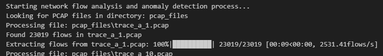
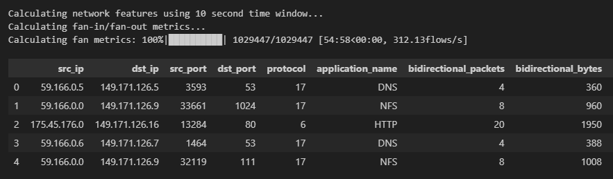
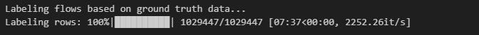
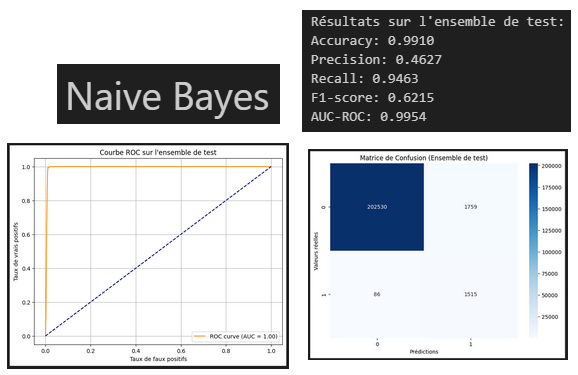
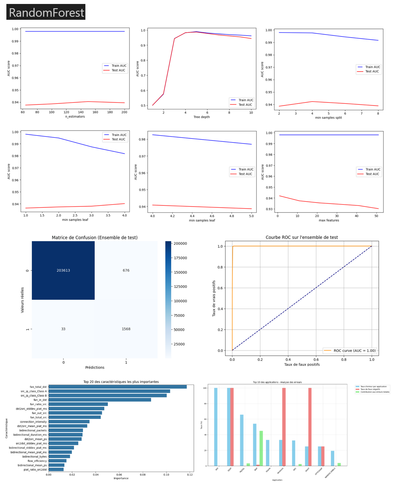

# **Final report**
Marc Perricher
ENSIBS Vannes : Cyberdata 2022-2025

---

## **Abstract**

This project addresses the critical task of **supervised flow classification** in the domain of cybersecurity. The objective is to process and analyze network traffic flows derived from over fifty PCAP files, collected within a virtual infrastructure. These flows are correlated with a ground truth dataset (`TRAIN.gt`) that identifies traffic patterns relevant to cyberattacks. 

The workflow begins with **flow extraction** using NFStream, employing configurations that include idle and active timeouts of 60 and 120 seconds, respectively, as well as statistical feature enrichment. Advanced features, such as fan-in and fan-out metrics, are calculated over a sliding temporal window to capture network behavior comprehensively. Subsequently, the flows are **vectorized and labeled** through a log correlation process to prepare the dataset for machine learning classification.

For the supervised classification tasks, the dataset is partitioned in a stratified manner based on application-level protocols (e.g., HTTP, SSH). A cross-validation approach is employed to evaluate the performance of multiple classifiers, including k-NN, Naive Bayes, Random Forest, and Multilayer Perceptron, across five equally sized subsets of the training data. Further analysis extends to evaluating Naive Bayes and Random Forest classifiers without filtering by application name, simulating a broader intrusion detection scenario.

The classifiers are assessed using standard evaluation metrics such as accuracy, precision, recall, F1-score, and ROC-AUC. Cross-validation results are consolidated, and the classifiers are ranked based on their performance on the test dataset. The findings provide recommendations for implementing an Intrusion Detection System (IDS) leveraging supervised learning capabilities.

This report details the methodology, experimental protocol, and findings, culminating in a comprehensive evaluation of the classifiers’ performance. Insights gained through this work highlight the strengths and limitations of the tested models, offering practical guidance for deploying machine learning in real-world cybersecurity applications.

## **Introduction**

### **Objectives**
The project is structured around the following core objectives:

1. **Data Processing and Feature Engineering**:
   - Extract network traffic flows from over fifty PCAP files using NFStream.
   - Enrich the extracted data with statistical and structural network features such as fan-in and fan-out metrics, computed over a sliding temporal window.
   - Correlate flows with a ground truth dataset (`TRAIN.gt`) to assign labels, distinguishing normal traffic from anomalies.

2. **Dataset Preparation for Supervised Learning**:
   - Transform the labeled flows into a format suitable for machine learning, ensuring a robust representation of the data for classification tasks.
   - Implement a stratified partitioning of the dataset based on application-layer protocols (e.g., HTTP, SSH) to maintain proportional distributions of classes during cross-validation.

3. **Model Evaluation**:
   - Test multiple machine learning algorithms, including k-Nearest Neighbors (k-NN), Naive Bayes, Random Forest, and Multilayer Perceptron, on stratified subsets of the training data.
   - Perform a comparative analysis of classifier performance using various metrics such as accuracy, precision, recall, F1-score, and ROC-AUC.
   - Evaluate the generalizability of Naive Bayes and Random Forest models on data without filtering by application name.

### **Scope**
The report encompasses:
- A detailed explanation of the experimental pipeline, including data extraction, feature engineering, and classifier evaluation.
- A thorough analysis of cross-validation results across multiple algorithms, followed by a discussion of the trade-offs observed.
- Recommendations and insights for practitioners interested in deploying supervised learning techniques for intrusion detection.

## **Project Structure**

1. **Data Processing and Feature Extraction**:
   - **Objective**: Extract and preprocess flows from PCAP files, enrich them with statistical and structural features, and label them using the ground truth.
   - **Key Components**:
     - **Flow Extraction**:
       - Utilizes NFStream to parse PCAP files.
       - Extracts essential flow features (e.g., IP addresses, ports, protocol, packet statistics).
     - **Feature Enrichment**:
       - Computes fan-in and fan-out metrics based on a sliding temporal window.
       - Generates advanced network characteristics like packet inter-arrival times and flow durations.
     - **Labeling**:
       - Correlates flows with `TRAIN.gt` to assign anomaly labels using log correlation techniques.
   - **Output**: A labeled and enriched dataset saved in CSV format for machine learning, **indexed in ElasticSearch**.

2. **Dataset Preparation for Classification**:
   - **Objective**: Transform the labeled  dataset into a structure suitable for training machine learning models.
   - **Key Components**:
     - Stratified partitioning based on application names (e.g., HTTP, SSH) to ensure balanced subsets for evaluation.
     - Splitting into training and test datasets:
       - **80% Training**: Further divided into five stratified folds for cross-validation.
       - **20% Test**: Held out for final model evaluation.
     - Vectorization of features and normalization of numerical data.

3. **Supervised Classification**:
   - **Objective**: Evaluate the performance of multiple machine learning classifiers on the prepared dataset.
   - **Key Components**:
     - Implementing and tuning classifiers:
       - k-Nearest Neighbors (k-NN): Optimized for `k`.
       - Naive Bayes: Tuned with smoothing parameter `α`.
       - Random Forest: Optimized for the number of trees and tree depth.
       - Multilayer Perceptron (MLP): Tuned for the number of layers and neurons per layer.
     - Cross-validation:
       - Five-fold cross-validation performed on stratified subsets.
       - Average metrics computed across folds.
     - Evaluation without filtering by application name to assess generalizability.

4. **Results Analysis and Model Comparison**:
   - **Objective**: Summarize the performance of classifiers and recommend the best model for IDS deployment.
   - **Key Components**:
     - Metric-based comparison:
       - Accuracy, precision, recall, F1-score, and ROC-AUC.
     - Ranking of models based on test data performance.
     - Discussion of trade-offs and practical recommendations for IDS implementation.

---

## Evaluation of Supervised Flow Classification

### 1. Experimental Protocol

#### 1.1 Objective
The primary goal of the evaluation is to classify network flows effectively, with a strong emphasis on high recall to minimize missed anomalies in a cybersecurity context. This aligns with the requirement of intrusion detection systems (IDS) to detect the maximum possible attacks.

#### 1.2 Dataset
The dataset comprises over fifty pcap files collected from a virtual infrastructure, paired with a ground truth file (`TRAIN.gt`). The ground truth lists flows characterized by attributes such as timestamps, source and destination IPs, ports, and protocol. This forms the basis for the supervised classification tasks.

#### 1.3 Data Preparation
Features extracted from the dataset were processed, with the target variable being the "label" column that distinguishes between normal and anomalous flows. Data encoding was applied where necessary (e.g., encoding categorical fields like `application_name`). The dataset was split into 80% training and 20% testing sets, maintaining the label distribution via stratified sampling.

---

### 2. Classifiers and Hyperparameter Selection

#### 2.1 Models Evaluated
2. **Naive Bayes**: The Multinomial variant was selected, with the smoothing parameter `α` tuned extensively.
3. **Random Forest**: A robust ensemble model, tuned for the number of trees, tree depth, and splitting criteria.

#### 2.2 Hyperparameter Optimization
Extensive hyperparameter tuning was conducted using grid search or manual testing:
- **Random Forest**: The optimal model utilized 150 trees, a maximum depth of 5, a minimum of 4 samples per split, and 4 samples per leaf. Feature importance was also analyzed to enhance interpretability.
- **Naive Bayes**: Achieved optimal performance with a smoothing parameter (`α`) of \(10^{-40}\).

---

### 3. Evaluation Metrics

The following metrics were used to evaluate model performance:
- **Accuracy**: Overall correctness of predictions.
- **Precision**: Proportion of true positives among positive predictions.
- **Recall**: Proportion of true positives among actual positives. Emphasized in model selection due to the IDS objective.
- **F1-Score**: Harmonic mean of precision and recall.
- **ROC Curve and AUC**: Used to evaluate the trade-off between sensitivity and specificity.

---

### 4. Results and Observations

#### 4.1 Naive Bayes
- **Performance**:
  - Accuracy: ~94%
  - Recall: High at 94%, ensuring most attacks are detected.
  - Precision: Moderate, reflecting some false positives.
- **ROC AUC**: Demonstrated strong discriminative power.
- Observations: Precision dropped due to more false positives, but recall remained robust, aligning with the IDS requirements.

#### 4.2 Random Forest
- **Hyperparameter Analysis**:
  - Best results with 150 estimators and a tree depth of 5.
  - Validation and test AUC remained consistent, showcasing generalization.
- **Final Performance**:
  - Accuracy: ~98%
  - Recall: ~97%
  - F1-Score: ~97%
  - ROC AUC: Excellent at ~0.98.
- Observations: Delivered a balance of high recall and low false positives, making it a strong candidate for IDS.

---

### 5. Cross-Validation
A 5-fold cross-validation was performed:
- Each fold showed consistent performance metrics, indicating model stability.
- Variations between folds were minimal, with recall remaining consistently high.

---

### 6. ROC Curves
- **Naive Bayes** and **Random Forest** both exhibited excellent ROC curves with high AUC values.
- Random Forest consistently outperformed Naive Bayes in terms of AUC, precision, and recall across all tasks.

---

### 7. Model Comparison and Recommendation

Based on the evaluation metrics:
1. **Random Forest** emerged as the top-performing model due to its balance of precision and recall and its ability to generalize across various tasks.
2. **Naive Bayes** offers a simpler alternative with high recall but may not handle class imbalance as effectively as Random Forest.

### Recommendation
For implementing an IDS with supervised learning capabilities, **Random Forest** is recommended due to its superior recall and lower false-positive rate, ensuring robust anomaly detection with minimal misses.
